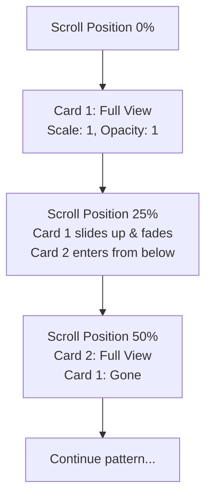
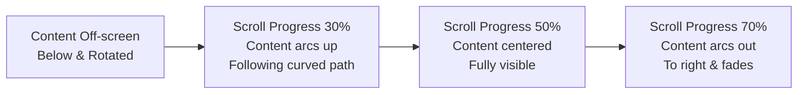
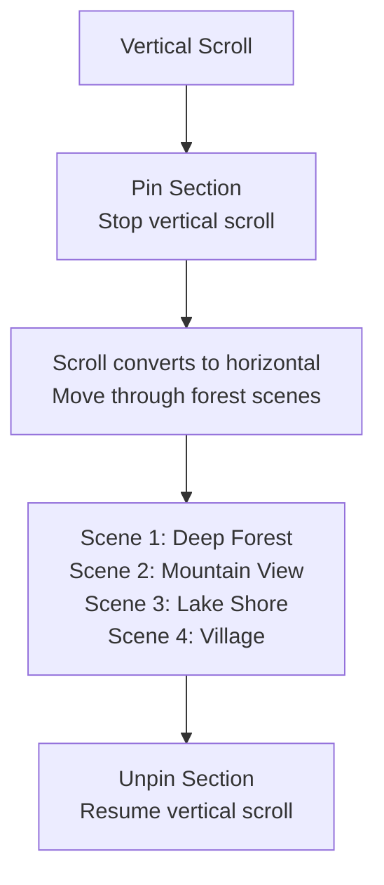
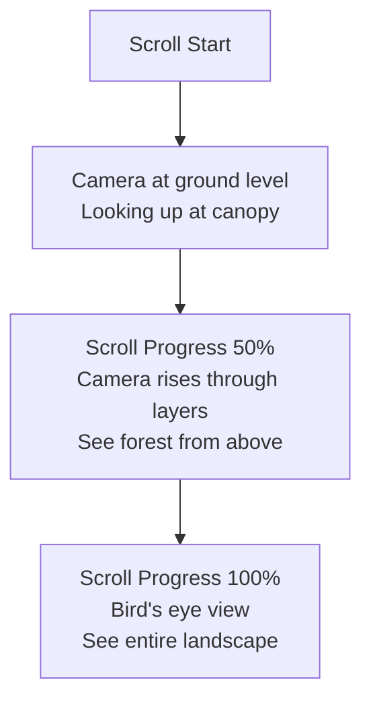

# Advanced Forest Scroll Experience v2.0

## New Concepts Based on Feedback

### 1. Card Deck Transition System

**Concept:** Instead of stacking, cards slide over each other like a deck of cards being dealt



**Implementation:**

- Pin the section during scroll
- Each card occupies 100vh of scroll distance
- Cards slide in from bottom with 3D perspective
- Previous card slides up and fades out
- Progress indicator shows card position

### 2. Arc/Curved Content Reveal

**Concept:** Content follows an arc path as it enters/exits viewport



**Arc Motion Path:**

- Content follows SVG path: `M 0 500 Q 400 0 800 500`
- Rotation follows tangent of curve
- Scale increases then decreases (0.8 → 1.0 → 0.8)
- Opacity follows same curve

### 3. Horizontal Scroll Section

**Concept:** Vertical scroll pauses, content scrolls horizontally through forest scenes



**Horizontal Journey:**

- 4 distinct scenes, each 100vw wide
- Trees and elements at different depths parallax horizontally
- Progress bar shows journey position
- Scene transitions with cross-fade

### 4. Natural Card Designs (Leaf/Branch Cards)

**Concept:** Cards shaped like leaves or sitting on branches instead of rectangles

**Leaf Card Design:**

```
        /\
       /  \
      |    |
       \  /
        \/
```

- SVG clip-path in leaf shape
- Content follows leaf contour
- Stem acts as progress indicator
- Different leaf shapes for different regions

**Branch Card Design:**

- Cards appear to hang from tree branches
- Branch SVG at top of section
- Cards swing slightly on hover (physics-based)
- Connected by vines that sway

### 5. Scroll-Triggered 3D Forest Depth

**Concept:** Using CSS 3D transforms to create depth as you scroll



**3D Layers:**

- Ground level: Tree trunks, ferns, mushrooms
- Mid level: Branches, birds, butterflies
- Canopy level: Leaves, sunlight rays
- Aerial view: Clouds, distant mountains

### 6. Organic Navigation Elements

**Vine Progress Bar:**

- Progress shown as vine growing
- Leaves appear at milestones
- Animated tendrils reaching out

**Moss-Covered Indicators:**

- Section indicators look like moss on bark
- Glow when active
- Spores float off on hover

## Technical Implementation Plan

### Phase 1: Card Deck System

```typescript
// CardDeckSection component
interface CardDeckSectionProps {
  cards: CardData[];
}

// Each card gets pinned section
// ScrollTrigger with scrub controls card transition
// Cards use 3D transform: translateZ for depth
```

### Phase 2: Arc Motion

```typescript
// Use GSAP MotionPathPlugin
// Content follows SVG path
// Rotation auto-calculated from path tangent
// ScrollTrigger controls progress along path
```

### Phase 3: Horizontal Scroll

```typescript
// Pin section with ScrollTrigger
// Map vertical scroll to horizontal transform
// Parallax layers move at different speeds
// Scene detection for content changes
```

### Phase 4: Leaf Cards

```typescript
// SVG clip-path definitions
// Custom card component with leaf shape
// Organic borders with SVG filters
```

## Inspiration References

### Websites to Study:

1. **Apple AirPods Pro** - Scroll-triggered 3D transforms
2. **Google Arts Experiments** - Horizontal scroll storytelling
3. **Locomotive.ca** - Smooth scroll with parallax
4. **Rive.app** - Interactive animations
5. **ActiveTheory.net** - WebGL + scroll experiences

### Techniques to Implement:

- **Lenis Scroll** - Smooth momentum scrolling
- **GSAP ScrollTrigger** - Pin and scrub animations
- **CSS 3D Transforms** - Depth and perspective
- **SVG Filters** - Organic textures
- **Canvas/Three.js** - Particle systems for atmosphere

## Enhanced Visual Elements

### Organic Shapes:

- **Leaf Cards:** Custom SVG clip-paths
- **Bark Textures:** SVG filters on backgrounds
- **Moss Accents:** Green gradient overlays
- **Fern Fronds:** Animated border decorations

### Atmospheric Effects:

- **Sunlight Rays:** CSS gradients with animation
- **Dust Particles:** Canvas particle system
- **Water Droplets:** On leaves after "rain" section
- **Butterflies:** SVG animations triggered by scroll

## Performance Optimizations:

- Use `content-visibility: auto` for off-screen sections
- Lazy load images with blur-up placeholders
- Use `will-change` sparingly and remove after animation
- Throttle scroll events to RAF
- Use Intersection Observer for triggering
