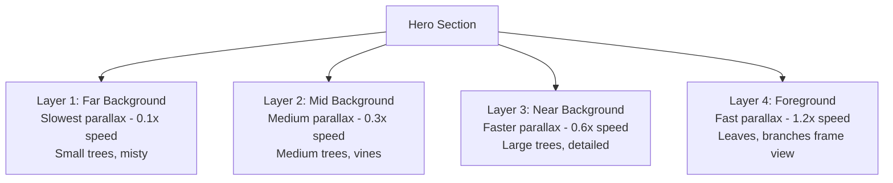
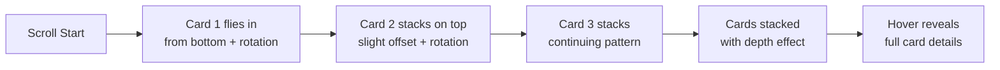
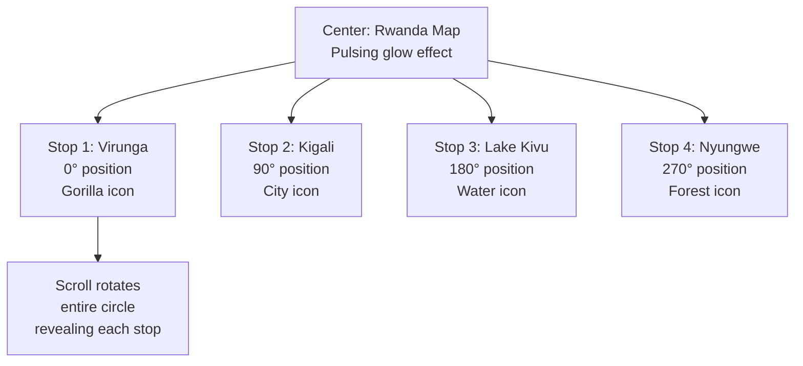

# Forest Adventure Scroll Experience - Architecture Plan

## Vision

Create an immersive, adventure-like navigation experience where scrolling through the page feels like journeying through a Rwandan forest. Trees, foliage, and wildlife elements respond to scroll with parallax effects, cards stack and reveal like discovering hidden gems, and a circular journey guides users through different regions.

## Core Experience Components

### 1. Multi-Layer Parallax Forest Background

**Concept:** Trees at different depths create a sense of moving through a forest



**Implementation:**

- Use `gsap.ScrollTrigger` with different `yPercent` values per layer
- Trees positioned absolutely with random placement
- Opacity gradients based on depth (farther = more transparent/misty)
- SVG trees with varying sizes and variants scattered throughout

### 2. Stacked Cards Discovery Experience

**Concept:** Cards fly in and stack as user scrolls, then spread out on hover



**Animation Sequence:**

1. Each card starts below viewport with rotation (-5° to 5°)
2. ScrollTrigger brings cards into view with stagger
3. Cards stack with slight vertical offset and rotation
4. Hovering expands the hovered card, compresses others
5. Click navigates to region listings

### 3. Circular Journey Navigation

**Concept:** A compass-like element that rotates as you scroll, revealing destinations



**Scroll Behavior:**

- Full 360° rotation mapped to scroll progress
- Active stop highlights and scales up
- Connecting path draws itself as you scroll
- Clicking a stop scrolls to that section

### 4. Floating Forest Elements

**Concept:** Ambient elements that float and respond to scroll

**Elements:**

- **Leaves:** Fall slowly, drift horizontally on scroll
- **Fireflies:** Glowing dots that cluster around content
- **Bird silhouettes:** Fly across screen on scroll milestones
- **Mist layers:** Opacity changes with scroll depth

### 5. Section Transitions

**Concept:** Each section feels like emerging into a different forest clearing

**Transition Types:**

- **Fade through mist:** Previous section fades into white mist, new section emerges
- **Tree curtain:** Large trees slide apart to reveal next section
- **Ground level change:** Parallax creates feeling of descending/ascending terrain

## Technical Architecture

### Component Structure

```
ForestExperience/
├── ForestParallaxContainer.tsx    # Main wrapper with layers
├── ParallaxTreeLayer.tsx          # Individual depth layer
├── StackedDiscoveryCards.tsx      # Stacking card animation
├── CircularJourney.tsx            # Rotating compass navigation
├── FloatingElements.tsx           # Ambient particles
├── ForestTransition.tsx           # Section transition wrapper
└── TreeVariants.tsx               # Extended SVG tree library
```

### GSAP ScrollTrigger Setup

```typescript
// Parallax layers with different speeds
layers.forEach((layer, index) => {
  const speed = 0.1 + index * 0.2; // 0.1, 0.3, 0.5, 0.7, 0.9
  gsap.to(layer, {
    yPercent: 30 * speed,
    ease: "none",
    scrollTrigger: {
      trigger: container,
      start: "top bottom",
      end: "bottom top",
      scrub: 1,
    },
  });
});
```

### Performance Considerations

- Use `will-change: transform` on animated elements
- Limit simultaneous animations to 10-15 elements
- Use CSS containment for isolated sections
- Lazy load off-screen tree SVGs
- Use `transform3d` for GPU acceleration

## Visual Design Tokens

### Forest Color Palette

- **Deep Forest:** #1a3d2e (background base)
- **Forest Light:** #2d5a3d (mid-tone trees)
- **Forest Accent:** #3d6b4e (highlights)
- **Mist:** rgba(255,255,255,0.3) (atmosphere)
- **Sunlight:** #f4e4c1 (warm highlights)
- **Earth:** #6b4423 (tree trunks)

### Depth Scale

- **Far:** 0.3 opacity, 0.5 scale, blur(2px)
- **Mid:** 0.6 opacity, 0.8 scale, blur(1px)
- **Near:** 0.9 opacity, 1.0 scale, no blur
- **Foreground:** 1.0 opacity, 1.2 scale, slight shadow

## Interaction Design

### Scroll Behaviors

1. **Smooth momentum scrolling** - Native CSS `scroll-behavior: smooth`
2. **Pin sections** - Key moments pause scroll for animation
3. **Progress indicators** - Subtle scroll progress shown in tree rings

### Hover States

- Trees sway slightly on hover (CSS transform)
- Cards lift and reveal details
- Journey stops pulse and show preview

### Mobile Adaptations

- Reduce parallax intensity by 50%
- Simplify floating elements
- Touch-friendly card interactions (swipe to reveal)
- Vertical journey compass instead of circular

## Implementation Phases

### Phase 1: Foundation

- Set up parallax container with 3 depth layers
- Place random trees in each layer
- Basic scroll-triggered animations

### Phase 2: Cards

- Implement stacked card component
- Scroll-triggered fly-in animations
- Hover interactions

### Phase 3: Journey

- Build circular navigation component
- Scroll-linked rotation
- Stop highlighting logic

### Phase 4: Polish

- Add floating particles
- Section transitions
- Performance optimization
- Mobile responsiveness

## Success Metrics

- 60fps during scroll animations
- < 100ms response to scroll
- Intuitive navigation (user testing)
- Memorable "wow" moments
